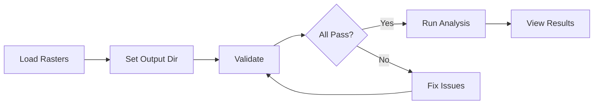

# Quick Start

This guide walks you through your first land use/land cover change analysis in just a few steps.

## Prerequisites

Before starting, ensure you have:

- [x] QGIS 3.28 or higher installed
- [x] The Spatiotemporal LULC Analysis plugin installed ([Installation Guide](installation.md))
- [x] Two or more categorical LULC rasters for different years

!!! info "What are categorical rasters?"
    Categorical rasters contain integer values where each value represents a land use/land cover class (e.g., 1 = Forest, 2 = Agriculture, 3 = Urban). These are typically derived from satellite imagery classification.

## Step 1: Open the Plugin

1. In QGIS, go to **Plugins** > **Spatiotemporal LULC Analysis**
2. A dock panel will appear on the right side of your screen

## Step 2: Add Your Rasters

You can add rasters in two ways:

=== "Add From Files"

    1. Click the **Add Files** button
    2. Navigate to your raster files (.tif, .tiff, or .img)
    3. Select multiple files by holding ++ctrl++ (or ++cmd++ on macOS)
    4. Click **Open**

=== "Add From Project"

    1. First, load your rasters into QGIS
    2. Click the **Add From Project** button
    3. Select the layers you want to analyze
    4. Click **OK**

!!! tip "Automatic Year Detection"
    The plugin automatically extracts years from filenames containing patterns like `2010`, `2015`, `2020`, etc. You can manually edit years in the table if needed.

## Step 3: Configure Basic Settings

1. **Output Directory**: Click **Browse** and select where to save results
2. **NoData Value**: Choose how to handle NoData:
    - *Use raster NoData* - Uses the NoData value defined in each raster
    - *Override* - Enter a custom NoData value
3. **AOI (Optional)**: Select a polygon layer to limit analysis to a specific area

## Step 4: Validate Inputs

Before running the analysis, validate your inputs:

1. Click the **Validate Inputs** button
2. Review the validation results in the **Validation** tab
3. Address any **FAIL** items before proceeding

!!! warning "Common Validation Issues"
    - **CRS mismatch**: All rasters must use the same coordinate reference system
    - **Resolution mismatch**: Pixel sizes must be identical
    - **Extent mismatch**: Rasters should cover the same area

## Step 5: Run the Analysis

1. Click the green **Run Analysis** button
2. Monitor progress in the progress bar and log panel
3. Wait for the "Analysis complete" message

## Step 6: View Your Results

After analysis completes:

- **CSV files** are saved to your output directory
- **Rasters** (change frequency, hotspots) are automatically added to QGIS
- **Charts** (if enabled) are in the `charts/` subdirectory

### Quick Output Overview

| File | Description |
|------|-------------|
| `area_by_class.csv` | Area of each class per year |
| `net_gross_change_*.csv` | Gain/loss per class for each interval |
| `transition_matrix_*.csv` | Full from-to transition matrix |
| `change_frequency.tif` | Count of changes per pixel |
| `change_hotspot_*.tif` | Kernel density hotspot maps |
| `charts/*.html` | Interactive visualizations |

## Example Workflow

## Next Steps

- Learn about all [input options](../user-guide/inputs.md)
- Understand the [validation checks](../user-guide/validation.md)
- Explore all [output types](../outputs/overview.md)
- Review the [methodology](../reference/methodology.md) behind the analysis
