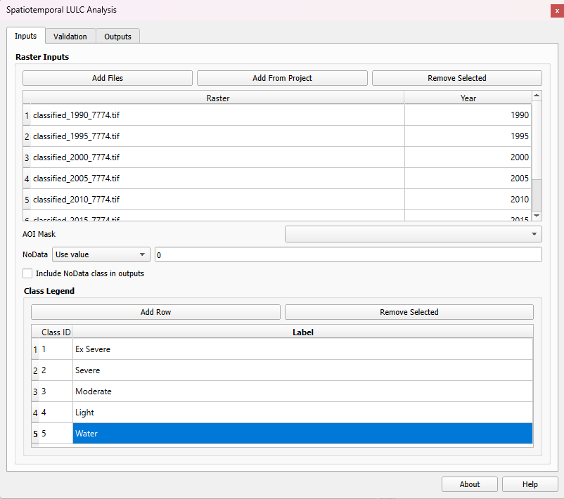
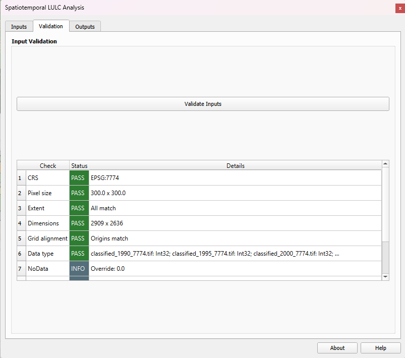
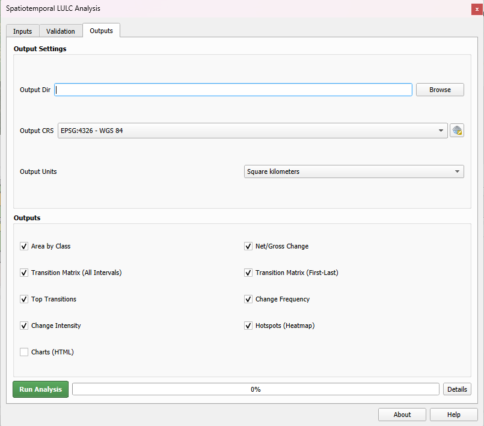

# Spatiotemporal LULC Analysis

**See change, not just snapshots.**

Spatiotemporal LULC Analysis is a QGIS plugin that transforms multi-year categorical rasters into comprehensive land use/land cover change reports. Generate transition matrices, hotspot maps, change intensities, and interactive charts in a single run.

-   :material-download:{ .lg .middle } **Easy Installation**

    ---

    Install directly from QGIS Plugin Manager or download from GitHub

    [:octicons-arrow-right-24: Installation](getting-started/installation.md)

-   :material-rocket-launch:{ .lg .middle } **Quick Start**

    ---

    Get up and running with your first analysis in minutes

    [:octicons-arrow-right-24: Quick Start](getting-started/quickstart.md)

-   :material-file-document-multiple:{ .lg .middle } **Comprehensive Outputs**

    ---

    CSV tables, GeoTIFF rasters, and interactive HTML charts

    [:octicons-arrow-right-24: Outputs](outputs/overview.md)

-   :material-function-variant:{ .lg .middle } **Transparent Methods**

    ---

    Fully documented formulas and methodology

    [:octicons-arrow-right-24: Methodology](reference/methodology.md)

## Key Features

### Analysis Outputs

- **Area by class** - Per-class pixel counts and area across each input raster
- **Net/Gross change** - Gain and loss per class for each time interval
- **Transition matrices** - Full from-to matrices for each interval and first-to-last year
- **Top transitions** - Ranked list of the largest class-to-class conversions
- **Change intensity** - Interval and annualized change rates
- **Change frequency raster** - Count of transitions per pixel across all years
- **Change hotspots** - Kernel density heatmaps highlighting concentrated change

### Output Formats

| Format | Outputs |
|--------|---------|
| **CSV** | Area tables, transition matrices, top transitions, intensity metrics |
| **GeoTIFF** | Change frequency raster, hotspot heatmaps |
| **HTML** | Interactive Plotly.js charts, Sankey diagrams |

### Robust Validation

Before running any analysis, the plugin validates your inputs:

- CRS consistency across all rasters
- Matching pixel sizes, extents, and dimensions
- Grid alignment verification
- NoData handling and data type checks
- Class range detection and AOI coverage calculation

## Gallery

<figure markdown>
  { width="100%" }
  <figcaption>Input rasters and configuration panel</figcaption>
</figure>

<figure markdown>
  { width="100%" }
  <figcaption>Comprehensive validation checks</figcaption>
</figure>

<figure markdown>
  { width="100%" }
  <figcaption>Analysis outputs and reports</figcaption>
</figure>

## Requirements

- **QGIS** 3.28 or higher
- No additional Python packages required

## Getting Help

- [GitHub Issues](https://github.com/raymukesh/spatiotemporal_lulc_analysis/issues) - Report bugs or request features
- [FAQ](faq.md) - Common questions and troubleshooting

## License

MIT License - Copyright 2026 Mukesh Ray
