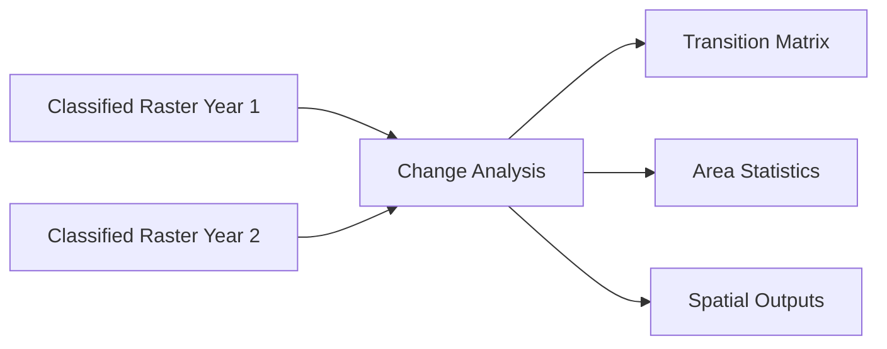
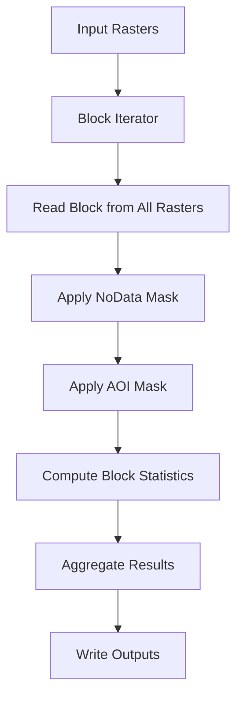

# Methodology

This page describes the analytical approach used by the Spatiotemporal LULC Analysis plugin.

## Overview

The plugin performs **post-classification change detection** on categorical land use/land cover rasters. Rather than comparing raw spectral data, it compares classified maps to identify where and how land cover classes have changed.



## Analysis Framework

### Spatial Units

The fundamental unit of analysis is the **pixel**. Each pixel in each input raster contains a categorical class value representing the dominant land cover type at that location.

### Temporal Structure

The plugin analyzes change across **intervals** - pairs of consecutive years in your time series:

| Input Years | Intervals Analyzed |
|------------|-------------------|
| 2010, 2015, 2020 | 2010→2015, 2015→2020 |
| 2000, 2005, 2010, 2015 | 2000→2005, 2005→2010, 2010→2015 |

Additionally, a **first-to-last** comparison ignores intermediate years to show cumulative change.

### Valid Pixel Set

For each interval, analysis considers only pixels that are valid in **both** years:

$$\Omega = \Omega_{t_0} \cap \Omega_{t_1}$$

Where:

- $\Omega_{t_0}$ = pixels valid at time 0 (not NoData, within AOI)
- $\Omega_{t_1}$ = pixels valid at time 1 (not NoData, within AOI)
- $\Omega$ = pixels analyzed for this interval

This ensures fair comparison by excluding pixels with missing data in either year.

## Core Metrics

### Area by Class

For each year, the plugin counts how many pixels belong to each class:

- **Pixel count**: Number of pixels with that class value
- **Area**: Pixel count × pixel area (in selected units)
- **Percentage**: Class area / total valid area × 100

### Transition Accounting

For each interval, every pixel falls into one of two categories:

1. **Persistence**: Same class in both years
2. **Transition**: Different class between years

The **transition matrix** records all pixel movements:

| | To Class A | To Class B | To Class C |
|-|------------|------------|------------|
| **From Class A** | Persistence | A→B | A→C |
| **From Class B** | B→A | Persistence | B→C |
| **From Class C** | C→A | C→B | Persistence |

### Gain and Loss

From the transition matrix, we derive:

- **Gain for class k**: Sum of column k (excluding diagonal)
- **Loss for class k**: Sum of row k (excluding diagonal)
- **Net change**: Gain - Loss
- **Gross change**: Gain + Loss

### Change Intensity

Intensity metrics normalize change by total area and time:

- **Interval intensity**: Fraction of pixels that changed
- **Annual intensity**: Interval intensity ÷ number of years

## Spatial Analysis

### Change Frequency

The change frequency raster counts how many times each pixel changed across the entire time series:

- Value 0: Pixel never changed (persistent)
- Value 1: Pixel changed once
- Value n-1: Pixel changed in every interval

This highlights areas of repeated change vs. stable areas.

### Change Hotspots

Hotspot maps use **Kernel Density Estimation (KDE)** to create smooth surfaces showing change concentration:

1. Changed pixels are converted to point locations
2. A Gaussian kernel is applied to each point
3. Kernels are summed to create a continuous density surface
4. Higher values indicate more concentrated change

**Parameters:**

- Kernel: Gaussian
- Radius: 1000 map units
- Sample limit: 50,000 points (for performance)

## Processing Approach

### Block-Based Processing

To handle rasters of any size without exhausting memory, the plugin uses **block-based processing**:

1. Rasters are divided into 256×256 pixel blocks
2. Each block is processed independently
3. Results are aggregated across all blocks
4. Memory usage remains bounded regardless of raster size

```
+-------+-------+-------+-------+
| Block | Block | Block | Block |
| (0,0) | (1,0) | (2,0) | (3,0) |
+-------+-------+-------+-------+
| Block | Block | Block | Block |
| (0,1) | (1,1) | (2,1) | (3,1) |
+-------+-------+-------+-------+
```

### Data Flow



## Methodological Considerations

### Classification Consistency

The plugin assumes that:

- Class definitions are consistent across all input years
- The same class ID represents the same land cover type
- Classification accuracy is acceptable for change detection

!!! warning "Garbage In, Garbage Out"
    Change detection quality depends entirely on input classification quality. Misclassification in either year appears as false change.

### Scale Effects

Results depend on the spatial resolution of input data:

- **Coarse resolution**: May miss small-scale changes
- **Fine resolution**: Captures detailed patterns but increases processing time
- **Mixed pixels**: Pixel values represent dominant cover type

### Temporal Considerations

- **Interval length matters**: Longer intervals capture more cumulative change
- **Seasonality**: Ensure comparable acquisition dates across years
- **Intermediate changes**: May be missed if not captured by input years

## Comparison with Other Methods

| Approach | This Plugin | Alternative Methods |
|----------|------------|---------------------|
| **Input data** | Classified rasters | Raw imagery, spectral data |
| **Change detection** | Post-classification comparison | Image differencing, trajectory analysis |
| **Metrics** | Area, transitions, intensity | Spectral change vectors, time series analysis |
| **Spatial outputs** | Frequency, hotspots | Change maps, trend surfaces |

## References

The methods implemented in this plugin draw from established LULC change analysis literature:

1. Post-classification comparison is a standard approach for categorical change detection
2. Transition matrices follow conventional from-to accounting frameworks
3. Change intensity metrics are normalized measures suitable for cross-study comparison
4. Kernel density estimation provides spatial smoothing for pattern visualization

For detailed formulas, see the [Formulas](formulas.md) page.
