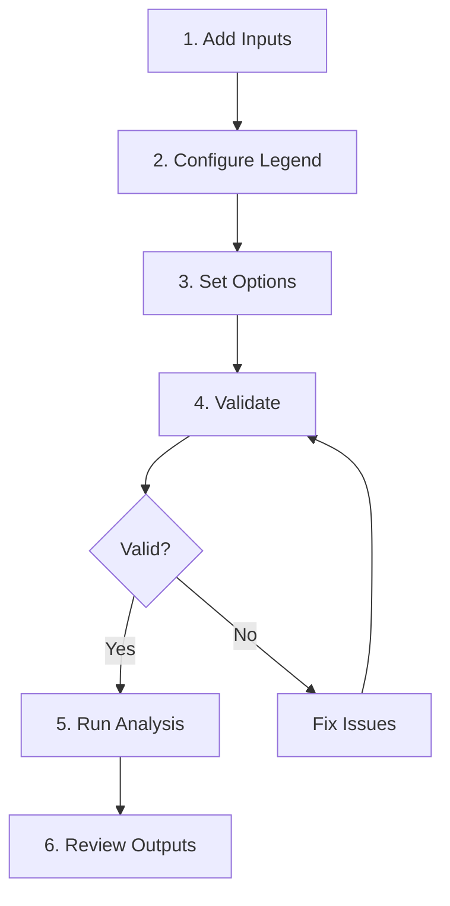

# User Guide Overview

The Spatiotemporal LULC Analysis plugin provides a comprehensive workflow for analyzing land use/land cover change across multiple time periods. This guide covers all aspects of using the plugin.

## Plugin Interface

The plugin opens as a dock panel with four main tabs:

```
+------------------------------------------+
|  Spatiotemporal LULC Analysis            |
+------------------------------------------+
| [Inputs] [Legend] [Options] [Validation] |
+------------------------------------------+
|                                          |
|  Tab content area                        |
|                                          |
+------------------------------------------+
|  [Validate Inputs]    [Run Analysis]     |
+------------------------------------------+
|  Progress bar                            |
+------------------------------------------+
|  Log messages                            |
+------------------------------------------+
```

### Tab Overview

| Tab | Purpose |
|-----|---------|
| **Inputs** | Add rasters, set years, configure AOI and NoData |
| **Legend** | Map class IDs to descriptive labels |
| **Options** | Select outputs, units, and CRS |
| **Validation** | View validation check results |

## Workflow Summary

The recommended workflow follows these stages:



### 1. Add Inputs

Load your multi-year LULC rasters and configure basic settings:

- Add raster files from disk or from loaded QGIS layers
- Verify/edit the year for each raster
- Optionally select an AOI polygon layer
- Configure NoData handling

[Detailed guide: Adding Inputs](inputs.md)

### 2. Configure Legend (Optional)

Map numeric class IDs to human-readable labels:

- Add class ID to label mappings
- Labels appear in all CSV outputs and charts
- Supports up to 1024 classes

[Detailed guide: Configuration](configuration.md)

### 3. Set Options

Choose what outputs to generate:

- Select specific output types (CSV, rasters, charts)
- Set the output coordinate reference system
- Choose area units (pixels, m², km²)
- Specify output directory

[Detailed guide: Configuration](configuration.md)

### 4. Validate

Run validation checks before analysis:

- CRS, pixel size, extent consistency
- Grid alignment verification
- NoData and data type checks
- Class range detection

[Detailed guide: Validation](validation.md)

### 5. Run Analysis

Execute the analysis:

- Click "Run Analysis"
- Monitor progress bar and log
- Wait for completion message

[Detailed guide: Running Analysis](running-analysis.md)

### 6. Review Outputs

Examine the generated results:

- CSV tables in output directory
- Rasters added to QGIS
- Charts in `charts/` subdirectory

[Detailed guide: Outputs Overview](../outputs/overview.md)

## Best Practices

!!! tip "Ensure Data Quality"
    - Use rasters with consistent classification schemes
    - Verify all years use the same class definitions
    - Check that NoData values are properly set in source rasters

!!! tip "Organize Your Workspace"
    - Create a dedicated output directory for each analysis
    - Use descriptive year values
    - Add a complete class legend for interpretable outputs

!!! tip "Start with Validation"
    - Always run validation before analysis
    - Address all FAIL items
    - Review WARN items for potential issues

## Keyboard Shortcuts

| Action | Shortcut |
|--------|----------|
| Remove selected raster | ++delete++ |
| Move raster up | Select and drag |
| Move raster down | Select and drag |

## Getting Help

If you encounter issues:

1. Check the [FAQ](../faq.md) for common solutions
2. Review the log panel for error messages
3. Report bugs on [GitHub Issues](https://github.com/raymukesh/spatiotemporal_lulc_analysis/issues)
