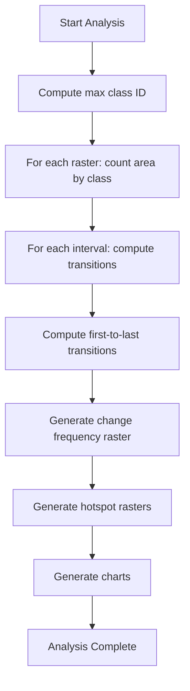

# Running Analysis

Once your inputs are configured and validated, you're ready to run the analysis.

## Pre-Run Checklist

Before clicking Run, verify:

- [x] Rasters added with correct years
- [x] Output directory specified
- [x] Validation passed (no FAIL items)
- [x] Desired outputs selected in Options tab
- [x] Legend configured (optional but recommended)

## Starting the Analysis

1. Click the green **Run Analysis** button
2. The button will be disabled during processing
3. Monitor progress in the progress bar and log panel

```
+------------------------------------------+
|  [Validate Inputs]    [Run Analysis]     |
+------------------------------------------+
|  ████████████░░░░░░░░░░░░░  45%          |
+------------------------------------------+
|  Processing interval 2010-2015...        |
|  Computing transition matrix...          |
|  Writing net_gross_change_2010_2015.csv  |
+------------------------------------------+
```

## Progress Monitoring

### Progress Bar

The progress bar shows overall completion based on:

- Number of rasters processed
- Number of analysis blocks completed
- Total blocks = (raster width / 256) × (raster height / 256) × number of rasters

### Log Panel

The log panel displays real-time messages:

| Message Type | Example |
|--------------|---------|
| **Start** | `Starting analysis with 3 rasters` |
| **Processing** | `Processing interval 2010-2015` |
| **Output** | `Writing area_by_class.csv` |
| **Raster added** | `Added change_frequency.tif to project` |
| **Completion** | `Analysis complete` |

## Processing Steps

The analysis follows this sequence:



### Detailed Processing Order

1. **Initialize**
    - Load all rasters
    - Apply AOI mask if specified
    - Set up NoData handling

2. **Area by Class**
    - For each raster, count pixels per class
    - Apply area factor for unit conversion
    - Write `area_by_class.csv`

3. **Interval Metrics** (for each consecutive year pair)
    - Count changed vs. unchanged pixels
    - Compute gain/loss per class
    - Build transition matrix
    - Rank top transitions
    - Calculate interval intensity
    - Write interval CSV files

4. **First-to-Last Comparison**
    - Compare first and last year only
    - Generate comprehensive transition summary
    - Write `transition_matrix_first_last_*.csv`

5. **Change Frequency Raster**
    - Count transitions per pixel across all intervals
    - Write `change_frequency.tif`
    - Add to QGIS project

6. **Hotspot Rasters** (for each interval)
    - Extract changed pixel locations
    - Apply kernel density estimation
    - Write `change_hotspot_*.tif`
    - Add to QGIS project

7. **Charts** (if enabled)
    - Generate HTML files with Plotly.js
    - Write to `charts/` subdirectory

## During Processing

!!! warning "Do Not Interrupt"
    Avoid closing QGIS or the plugin panel during analysis. If interrupted:

    - Partial outputs may be incomplete
    - Some files may not be written
    - Rasters may not be added to the project

### Memory Considerations

The plugin uses block-based processing (256×256 pixel blocks) to handle large rasters efficiently:

- Memory usage stays bounded regardless of raster size
- Processing time scales with total pixel count
- Very large rasters may take longer but won't exhaust memory

## After Completion

When analysis finishes:

1. **Log shows "Analysis complete"**
2. **Progress bar reaches 100%**
3. **Run Analysis button re-enables**

### Checking Outputs

**In QGIS:**

- Change frequency raster appears in Layers panel
- Hotspot rasters appear in Layers panel

**In Output Directory:**

```
output_directory/
├── area_by_class.csv
├── net_gross_change_2010_2015.csv
├── transition_matrix_2010_2015.csv
├── top_transitions_2010_2015.csv
├── change_frequency.tif
├── change_hotspot_2010_2015.tif
├── change_intensity.csv
└── charts/
    ├── area_by_class.html
    ├── net_gross_change.html
    └── ...
```

## Re-Running Analysis

To run analysis again with different settings:

1. Modify inputs, legend, or options as needed
2. Re-run validation if inputs changed
3. Click **Run Analysis**

!!! note "Files Overwritten"
    Running analysis again will overwrite existing files in the output directory. Use a new output directory to preserve previous results.

## Troubleshooting

### Analysis Won't Start

**Possible causes:**

- Validation has FAIL items → Fix and re-validate
- No output directory specified → Set directory in Inputs tab
- No rasters added → Add at least one raster

### Analysis Stops Unexpectedly

**Check:**

- QGIS message bar for errors
- Log panel for error messages
- Disk space in output directory

### Missing Outputs

**If some outputs are missing:**

- Verify they were enabled in Options tab
- Check log for any errors during that output
- For charts: verify `plotly.min.js` exists in `vendor/js/`

### Slow Processing

**For large datasets:**

- Disable hotspots (most intensive)
- Disable charts
- Use an AOI to limit the analysis area
- Consider downsampling rasters for initial exploration

## Output Details

For detailed information about each output:

- [CSV Outputs](../outputs/csv.md)
- [Raster Outputs](../outputs/rasters.md)
- [Chart Outputs](../outputs/charts.md)
